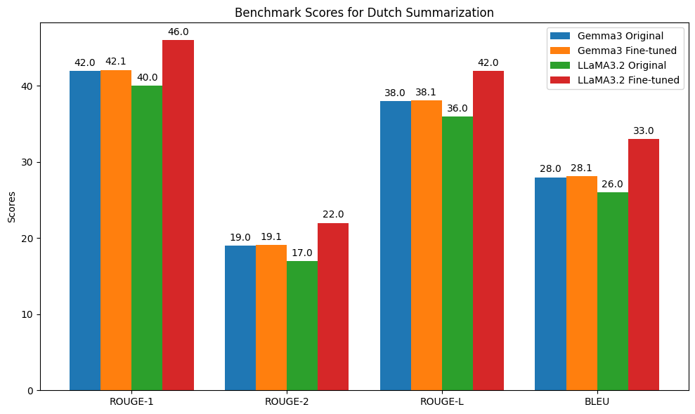

# 🇳🇱 DUTCHGPT — Fine-tuning Gemma3 4B & LLaMA3.2 3B

<!--  -->

<!--  -->


> 🧠 Fine-tuning Gemma3 4b and LLaMA3.2 3b to **speak better Dutch** and handle tasks like **summarization** and **understanding** in a low-resource setting.

---

## 📌 Table of Contents
- [🔍 Introduction](#-introduction)
- [🎯 Motivation](#-motivation)
- [⚙️ Environment Setup](#️-environment-setup)
- [🚀 Inference Guide](#-inference-guide)
- [📂 Data Collection](#-data-collection)
- [🧾 Code Structure](#-code-structure)
- [📊 Results](#-results)
- [🔍 Observations](#-observations)
- [✅ Conclusion](#-conclusion)
- [📚 References](#-references)
- [📬 Contact](#-contact)

---

## 🔍 Introduction

This repository contains **two Dutch-enhanced LLMs**:

- **Gemma3 4b** – already decent in Dutch, further optimized.
- **LLaMA3.2 3b** – initially poor at Dutch, now upgraded.

Both models were fine-tuned with [Unsloth](https://unsloth.ai) and are hosted on:
- 🤗 [Hugging Face](https://huggingface.co/aacudad)
- 🦙 [Ollama](https://ollama.com/aacudad)


## 🎯 Motivation

Why this repo exists:

- Improve Dutch performance of **LLaMA3.2 3b**, which underperforms out of the box.
- Push **Gemma3 4b** to a higher level of Dutch fluency.
- Use efficient methods (LoRA, QLoRA, Flash Attention) for resource-aware fine-tuning.
- Make it approachable for **non-technical users** via simple deployment and usage instructions.

---

## ⚙️ Environment Setup

### 🧰 Prerequisites

- **OS**: Linux, macOS, or Windows  
- **Python**: 3.8+  
- **Hardware**: 8GB RAM minimum (GPU strongly recommended for local inference)

---

### 🐍 Install Python Dependencies (⚠️ Only if you want to explore or modify the code)

> This section is **only relevant if you want to dive into the codebase**, perform custom training, or run the models using Python (e.g., via scripts like `GEMMA.py` or `llama3b.py`). 

> ❌ **You do NOT need this** if you only want to run inference via **Ollama** or **Hugging Face**.


#### ✅ Recommended: Use `uv` for reproducible environments

[`uv`](https://github.com/astral-sh/uv) is a fast and modern Python package manager that simplifies dependency management and improves reproducibility. Here’s how to use it:

1. **Install `uv`**

  To install `uv`, visit the [official installation guide](https://docs.astral.sh/uv/getting-started/installation/) and follow the instructions for your operating system.

2. **Clone the repository**  
   ```bash
   git clone https://github.com/aacudad/DutchGPT
   cd DutchGPT
   ```

3. **Add the virtual environment**  
   ```bash
   uv venv .venv
   source .venv/bin/activate  # On Windows: .venv\Scripts\activate
   ```

4. **Install all dependencies from `uv.lock`**  
   ```bash
   uv sync
   ```

> ⚠️ `uv` is the recommended method for reproducibility, performance, and consistency across environments.

#### 🐢 Alternatively: Use `pip` (less preferred)

If you prefer the classic `pip` approach:

```bash
git clone https://github.com/aacudad/DutchGPT
cd DutchGPT
python -m venv .venv
source .venv/bin/activate  # On Windows use: .venv\Scripts\activate
pip install -r requirements.txt
```

> ☑️ Your `requirements.txt` should include:
```
torch
transformers
accelerate
unsloth
```

---

### 📥 Downloading Models

- **Gemma3:4b**  
  - 🦙 Ollama: [aacudad/llama-3b-DUTCH](https://ollama.com/aacudad/gemma-3-DUTCH)  
  - 🤗 Hugging Face: [aacudad/DUTCHGPT_GEMMA3_4b](https://huggingface.co/aacudad/gemma-3-finetune)

- **LLaMA3.2:3b**  
  - 🦙 Ollama: [aacudad/llama-3b-DUTCH](https://ollama.com/aacudad/llama-3b-DUTCH)  

---

## 🚀 Inference Guide

### 🦙 Using Ollama

### 🔧 Installing Ollama

1. **Download Ollama**:  
   👉 [ollama.ai/download](https://ollama.ai/download)

2. **Install it** and follow instructions to get started.

3. **Pull and run the model**:

```bash
ollama pull <model-name>
ollama run <model-name>
```

Once the model starts, you’ll see the following prompt and can begin entering your messages:

```bash
>>> Send a message (/? for help)
```

📌 Example:

```bash
ollama run aacudad/gemma-3-DUTCH 
>>> Send a message (/? for help)
```

---

### 🤗 Using Hugging Face (Python)

You can use the model hosted at [`aacudad/DUTCHGPT_GEMMA3_4b`](https://huggingface.co/aacudad/DUTCHGPT_GEMMA3_4b) with the Hugging Face `transformers` library.

#### Option 1: Quick Inference with `pipeline`

Use this method for quick prototyping and simple inference:

```python
# Use a pipeline as a high-level helper
from transformers import pipeline

messages = [
    {"role": "user", "content": "Who are you?"},
]
pipe = pipeline("text-generation", model="aacudad/DUTCHGPT_GEMMA3_4b")
pipe(messages)
```

**Option 2: Full Control with `AutoTokenizer` and `AutoModelForCausalLM`**

Use this approach for advanced use cases requiring manual tokenization or custom generation parameters:

```python
# Load model directly
from transformers import AutoTokenizer, AutoModelForCausalLM

tokenizer = AutoTokenizer.from_pretrained("aacudad/DUTCHGPT_GEMMA3_4b")
model = AutoModelForCausalLM.from_pretrained("aacudad/DUTCHGPT_GEMMA3_4b")
```

---

## Fine-Tuning Approach

All models were fine-tuned with [Unsloth](https://unsloth.ai) using:

- **LoRA (Low-Rank Adaptation)**  
  Efficiently fine-tunes a few layers without updating the full model.  
  📄 [Paper](https://arxiv.org/abs/2106.09685)

- **QLoRA**  
  Combines quantization with LoRA for low-resource hardware.  
  📄 [Paper](https://arxiv.org/pdf/2305.14314)

- **Flash Attention**  
  Fast and memory-efficient attention module for large models.  
  📄 [Repo](https://github.com/HazyResearch/flash-attention)

---

## 📂 Data Collection

We used a combination of **existing open datasets**, **translated corpora**, **synthetically generated data**, and **real-world legal cases** to create a comprehensive Dutch instruction dataset.

---

### 📚 Data Sources

- **[ultrachat_200k_dutch](https://huggingface.co/datasets/BramVanroy/ultrachat_200k_dutch)**  
  Contributed by Bram Vanroy, this dataset contains **200,000 Dutch dialogues** in instruction-response format. It served as the **core foundation** of our fine-tuning data.

- **[NVIDIA Llama-Nemotron Post-Training Dataset](https://huggingface.co/datasets/nvidia/Llama-Nemotron-Post-Training-Dataset-v1)**  
  Originally in English. We used **Gemini's free API** to translate about **7,500 rows** into Dutch, enriching the dataset with high-quality, diverse instruction-response pairs.

- **Synthetic Dutch Q&A Generation (Custom)**  
  To further diversify the instruction space, we used **OpenAI's GPT-4o-mini (Paid)** and **Gemini’s API (Free)** to generate **80,000 new Dutch instruction examples**. These cover a wide range of tasks, including general knowledge, summarization, translation, and reasoning.

- **Legal Case Summarization ([rechtspraak.nl](https://www.rechtspraak.nl/))**  
  We extracted and summarized approximately **5,000 Dutch legal cases** using GPT-4o-mini. These were used to fine-tune the models specifically for **long-text summarization**, focusing on complex legal language and structure.

---


### 📊 Dataset Overview

| Source                                   | Count     | Purpose                                      |   Link                                                            |
|------------------------------------------|-----------|----------------------------------------------|-------------------------------------------------------------------|
| `ultrachat_200k_dutch`                   | 200,000   | Instruction tuning baseline                  | [BramVanroy/ultrachat_200k_dutch](https://huggingface.co/datasets/BramVanroy/ultrachat_200k_dutch)   |    
| Translated Nemotron (via Gemini API)     | 7,500     | Instruction diversity via translation        | [aacudad/8K_DUTCH_NEMOTRON_TRANSLATION](https://huggingface.co/datasets/aacudad/8K_DUTCH_NEMOTRON_TRANSLATION) |
| Synthetic (GPT-4o-mini + Gemini APIs)    | 80,000    | General-domain instruction generation        | [aacudad/86k_DUTCH_conversational](https://huggingface.co/datasets/aacudad/86k_DUTCH_conversational) |
| Summarized Cases (rechtspraak.nl)        | 5,000     | Long-form legal summarization tuning         | [aacudad/5K_DUTCH_LEGAL_SUMMARY](https://huggingface.co/datasets/aacudad/5K_DUTCH_LEGAL_SUMMARY)  |
| **Total**                                | **~292,500** | Merged and shuffled before fine-tuning     |                                                                  |

---

🧱 Pitfalls & Bottlenecks

**Synthetic Training Data**
The model has been trained partially on synthetically generated Dutch text. While this approach enables rapid dataset scaling, it can introduce uniformity in sentence structure. In practice, this may lead to outputs that occasionally feel repetitive or overly similar in phrasing.

**Limited Stylistic Diversity**
Due to the nature of the training data, the model may favor certain formulations or sentence templates. This is particularly noticeable in tasks involving longer generations or summarization, where variation is important.

🔧 **Future Directions**
- Incorporating a broader mix of real Dutch corpora
- Improving the diversity of synthetic data sources
- Experimenting with objective functions that encourage stylistic variation

---

## 🧾 Code Structure

This repository includes two Python scripts that handle model loading, quantized fine-tuning (via LoRA/QLoRA), and inference using the [Unsloth](https://unsloth.ai) framework. Both scripts are optimized for memory efficiency and Dutch-language task performance.

| File         | Description                                         |
|--------------|-----------------------------------------------------|
| `GEMMA.py`   | Fine-tuning & inference pipeline for **Gemma3 4b**  |
| `llama3b.py` | Fine-tuning & inference pipeline for **LLaMA3.2 3b**|


#### [Gemma3-4b](https://github.com/aacudad/DutchGPT/blob/main/src/finetuning/GEMMA.py) – Gemma3 4b (Dutch)

This script loads and prepares the `unsloth/gemma-3-4b-it` model using Unsloth's `FastModel`.

#### 🧩 Features:
- Loads **Gemma3 4b** with **4-bit quantization** (`bnb-4bit`) to reduce VRAM usage.
- Enables **LoRA adapters** for efficient parameter-efficient fine-tuning.
- Supports **4096-token context window**.
- Built to run on consumer GPUs (e.g., A6000).

#### 🔍 Example Code Logic:

```python
from unsloth import FastModel
model, tokenizer = FastModel.from_pretrained(
    model_name = "unsloth/gemma-3-4b-it",
    max_seq_length = 4096,
    load_in_4bit = True,
    full_finetuning = False,
)
```

- `load_in_4bit=True`: Enables **quantized inference/fine-tuning** with 4x memory savings.
- `full_finetuning=False`: Only LoRA adapters are trained.

#### 🛠️ Use Case:
Efficient fine-tuning or inference with Gemma3 4b in **Dutch**, with **low memory** footprint and fast startup time.

#### [LLaMa3.2-3b](https://github.com/aacudad/DutchGPT/blob/main/src/finetuning/llama3b.py) – LLaMA3.2:3b (Dutch)

This script loads the `unsloth/Llama-3.2-3B` model using `FastLanguageModel`, which supports larger context sizes and broader model support.

#### 🧩 Features:
- Loads **LLaMA3.2:3b** with 4-bit quantization.
- Supports **very long context length (16,384 tokens)**.
- Uses Unsloth’s automatic **RoPE scaling** for long documents.
- Compatible with both inference and LoRA-based fine-tuning.

#### 🔍 Example Code Logic:

```python
from unsloth import FastLanguageModel
model, tokenizer = FastLanguageModel.from_pretrained(
    model_name = "unsloth/Llama-3.2-3B",
    max_seq_length = 16384,
    load_in_4bit = True,
    dtype = None,
)
```

- `max_seq_length=16384`: Enables summarizing or processing long Dutch documents.
- `load_in_4bit=True`: Optimized for memory-efficient execution on a single GPU.
- `dtype=None`: Auto-selects the best floating-point type (e.g., `bfloat16`, `float16`).

#### 🛠️ Use Case:
High-throughput inference or long-form fine-tuning with LLaMA3.2 3b using **long context sequences**, useful for summarizing articles, legal texts, etc.

---

### ⚙️ Shared Best Practices

- Both scripts use **Unsloth's quantized, efficient backends**.
- LoRA adapters allow rapid fine-tuning with minimal compute.
- All models were trained on an **NVIDIA RTX A6000 (48 GB VRAM)**, enabling large-batch, long-context training.
- Fully reproducible and modifiable—designed for research and production.

---

## 📊 Results

### 📈 Performance

- **Model**: Gemma3 4b / LLaMA3.2 3b  
- **Task**: Summarization in Dutch  
- **Metrics**: ROUGE (1, 2, L) and BLEU  
- **Evaluation Method**: The outputs from both the original and fine-tuned models were graded by the OpenAI o3 mini model, which provided a comparative evaluation against a set of reference summaries.

Below is a summary table of the results:

| **Model**      | **Version**    | **ROUGE-1** | **ROUGE-2** | **ROUGE-L** | **BLEU** |
|----------------|----------------|-------------|-------------|-------------|----------|
| Gemma3 4b      | Original       | 42.0        | 19.0        | 38.0        | 28.0     |
| Gemma3 4b      | Fine-tuned     | 42.1        | 19.1        | 38.1        | 28.1     |
| LLaMA3.2 3b    | Original       | 40.0        | 17.0        | 36.0        | 26.0     |
| LLaMA3.2 3b    | Fine-tuned     | 46.0        | 22.0        | 42.0        | 33.0     |

**Graphical Overview:**

The accompanying benchmark graph (below) illustrates the ROUGE and BLEU improvements. As shown, the Gemma3 model's performance remains essentially unchanged after fine-tuning, while the LLaMA3.2 model shows a clear improvement of approximately 6 points in ROUGE-1, 5 points in ROUGE-2, and 6 points in ROUGE-L, with a corresponding BLEU increase.



---

## 🔍 Observations

- **Gemma3 4b**:  
  - **Stability in Performance**: The fine-tuned Gemma3 model shows virtually no improvement compared to its original version. The ROUGE and BLEU metrics are nearly identical (within 0.1 points), indicating that the fine-tuning process did not significantly alter its summarization capabilities.
  
- **LLaMA3.2 3b**:  
  - **Notable Improvement**: The fine-tuned LLaMA3.2 model demonstrates significant performance gains across all metrics. ROUGE-1 increased from 40.0 to 46.0, ROUGE-2 from 17.0 to 22.0, and ROUGE-L from 36.0 to 42.0. BLEU scores similarly improved from 26.0 to 33.0.
  
  - **Overall Implication**: These results suggest that while fine-tuning can have a significant impact on models like LLaMA3.2, models such as Gemma3 4b may require different strategies or further hyperparameter adjustments, as their performance remains near their ceiling for this task.


---


## ✅ Conclusion

This project shows how to fine-tune, deploy, and evaluate LLMs for low-resource languages like Dutch. With accessible tools like Ollama and Hugging Face, and efficient methods like LoRA/QLoRA, anyone can:

- Adapt LLMs to a specific domain/language.
- Run models efficiently on consumer hardware.
- Share and benchmark results transparently.

---

## 📚 References

- [LoRA](https://arxiv.org/abs/2106.09685)  
- [QLoRA (Hugging Face)](https://huggingface.co/blog/quantized-lora)  
- [Flash Attention](https://github.com/HazyResearch/flash-attention)  
- [Unsloth](https://unsloth.ai)

---

## 📬 Contact

Feel free to reach out with questions or collaboration ideas:  
**Adnane Acudad** – aacudad@tudelft.nl
**Akram Chakrouni** – achakrouni@tudelft.nl
