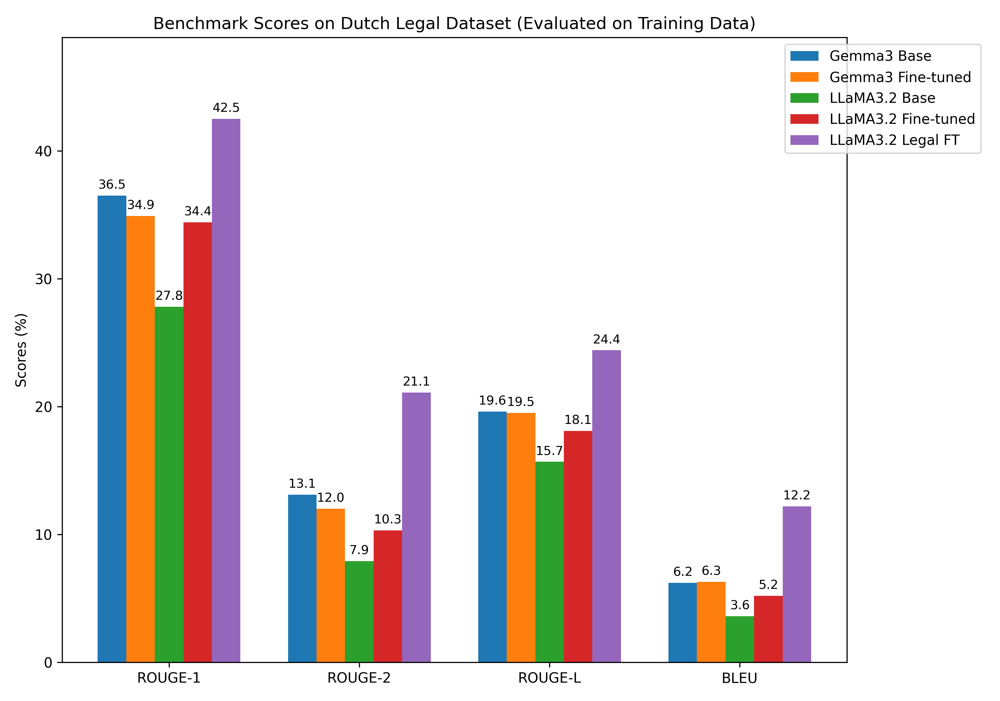

# 🇳🇱 DutchGPT — Fine-Tuning LLMs for Dutch


This repository contains code and resources for fine-tuning large language models (LLMs) for enhanced Dutch language performance, specifically focusing on tasks like summarization and comprehension in a low-resource language setting.

📑 **[Read the Full Technical Report](https://github.com/aacudad/DutchGPT/blob/main/Dutch_GPT__Report.pdf)** - Comprehensive details on methodology, experimental setup, and findings

## 📌 Table of Contents

- [🔍 Introduction](#-introduction)
- [🎯 Motivation](#-motivation)
- [⚙️ Environment Setup](#️-environment-setup)
- [🚀 Inference Guide](#-inference-guide)
- [📂 Data Collection](#-data-collection)
- [📊 Results](#-results)
- [🔍 Observations](#-observations)
- [✅ Conclusion](#-conclusion)
- [📚 References](#-references)
- [📬 Contact](#-contact)

## 🔍 Introduction

This project aims to enhance the performance of large language models in Dutch through parameter-efficient fine-tuning techniques. We explore:

- **Gemma3 4b**: Already decent in Dutch, further optimized
- **LLaMA3.2 3b**: Initially poor at Dutch, substantially improved
- **LLaMA3.2 Legal FT**: Task-specific model optimized for Dutch legal summaries

All models were fine-tuned using parameter-efficient techniques (LoRA/QLoRA) with 4-bit quantization on a diverse Dutch dataset.

## 🎯 Motivation

Why this repo exists:

- Improve Dutch performance of LLaMA3.2 3b, which underperforms out of the box
- Push Gemma3 4b to a higher level of Dutch fluency
- Use efficient methods (LoRA, QLoRA, Flash Attention) for resource-aware fine-tuning
- Make it approachable for non-technical users via simple deployment and usage instructions
- Explore the effects of task specialization in domain-specific models

## ⚙️ Environment Setup

### 🧰 Prerequisites

- OS: Linux, macOS, or Windows
- Python: 3.8+
- Hardware: 8GB RAM minimum (GPU strongly recommended for local inference)

### 🐍 Install Python Dependencies (⚠️ Only if you want to explore or modify the code)

This section is only relevant if you want to dive into the codebase, perform custom training, or run the models using Python (e.g., via scripts like GEMMA.py or llama3b.py).

❌ You do NOT need this if you only want to run inference via Ollama or Hugging Face.

#### ✅ Recommended: Use uv for reproducible environments

uv is a fast and modern Python package manager that simplifies dependency management and improves reproducibility. Here's how to use it:

**Install uv**

To install uv, visit the official installation guide and follow the instructions for your operating system.

**Clone the repository**

```bash
git clone https://github.com/aacudad/DutchGPT
cd DutchGPT
```

**Add the virtual environment**

```bash
uv venv .venv
source .venv/bin/activate  # On Windows: .venv\Scripts\activate
```

**Install all dependencies from uv.lock**

```bash
uv sync
```

⚠️ uv is the recommended method for reproducibility, performance, and consistency across environments.

#### 🐢 Alternatively: Use pip (less preferred)

If you prefer the classic pip approach:

```bash
git clone https://github.com/aacudad/DutchGPT
cd DutchGPT
python -m venv .venv
source .venv/bin/activate  # On Windows use: .venv\Scripts\activate
pip install -r requirements.txt
```

**Your requirements.txt should include:**

```
torch
transformers
accelerate
unsloth
```

## 🚀 Inference Guide

### 🦙 Using Ollama

#### 🔧 Installing Ollama

Download Ollama:
👉 [ollama.ai/download](https://ollama.ai/download)

Install it and follow instructions to get started.

Pull and run the model:

```bash
ollama pull <model-name>
ollama run <model-name>
```

Once the model starts, you'll see the following prompt and can begin entering your messages:

```
>>> Send a message (/? for help)
```

📌 Example:

```bash
ollama run aacudad/gemma-3-DUTCH 
>>> Send a message (/? for help)
```

### 🤗 Using Hugging Face (Python)

You can use the model hosted at Hugging Face with the transformers library.

**Option 1: Quick Inference with pipeline**

Use this method for quick prototyping and simple inference:

```python
# Use a pipeline as a high-level helper
from transformers import pipeline

messages = [
    {"role": "user", "content": "Wat zijn de eigenschappen van de Nederlandse taal?"},
]
pipe = pipeline("text-generation", model="aacudad/gemma-3-DUTCH")
pipe(messages)
```

**Option 2: Full Control with AutoTokenizer and AutoModelForCausalLM**

Use this approach for advanced use cases requiring manual tokenization or custom generation parameters:

```python
# Load model directly
from transformers import AutoTokenizer, AutoModelForCausalLM

tokenizer = AutoTokenizer.from_pretrained("aacudad/gemma-3-DUTCH")
model = AutoModelForCausalLM.from_pretrained("aacudad/gemma-3-DUTCH")
```

## 📂 Data Collection

We used a comprehensive dataset (~292,500 examples) assembled by merging several sources:

| Source | Count | Purpose | Link |
|--------|-------|---------|------|
| ultrachat_200k_dutch | 200,000 | Instruction tuning baseline | [BramVanroy/ultrachat_200k_dutch](https://huggingface.co/datasets/BramVanroy/ultrachat_200k_dutch) |
| Translated Nemotron | 7,500 | Instruction diversity via translation | [aacudad/8K_DUTCH_NEMOTRON_TRANSLATION](https://huggingface.co/datasets/aacudad/8K_DUTCH_NEMOTRON_TRANSLATION) |
| Synthetic Data | 80,000 | General-domain instruction generation | [aacudad/86k_DUTCH_conversational](https://huggingface.co/datasets/aacudad/86k_DUTCH_conversational) |
| Legal Case Summaries | 5,000 | Long-form legal summarization | [aacudad/5K_DUTCH_LEGAL_SUMMARY](https://huggingface.co/datasets/aacudad/5K_DUTCH_LEGAL_SUMMARY) |

For the task-specific legal model, a separate dataset of 100,000 Dutch legal case summaries was curated from [rechtspraak.nl](https://www.rechtspraak.nl).

### Data Formatting and Preprocessing

All data was standardized into a conversational instruction-following format suitable for fine-tuning. Each data point consists of a user instruction and the expected assistant response.

## 🧾 Code Structure

This repository includes two Python scripts that handle model loading, quantized fine-tuning (via LoRA/QLoRA), and inference using the Unsloth framework. Both scripts are optimized for memory efficiency and Dutch-language task performance.

| File | Description |
|------|-------------|
| GEMMA.py | Fine-tuning & inference pipeline for Gemma3 4b |
| llama3b.py | Fine-tuning & inference pipeline for LLaMA3.2 3b |

### Fine-Tuning Approach

All models were fine-tuned with [Unsloth](https://github.com/unslothai/unsloth) using:

- **LoRA (Low-Rank Adaptation)**: Efficiently fine-tunes a few layers without updating the full model. [Paper](https://arxiv.org/abs/2106.09685)
- **QLoRA**: Combines quantization with LoRA for low-resource hardware. [Paper](https://arxiv.org/abs/2305.14314)
- **Flash Attention**: Fast and memory-efficient attention module for large models. [Repository](https://github.com/Dao-AILab/flash-attention)

Key training parameters:
- **Training Duration**:
  - Gemma3 Fine-tuned: ~9 hours (15,000 steps)
  - LLaMA3.2 Fine-tuned: ~46 hours (one epoch)
  - LLaMA3.2 Legal Fine-tuned: ~3.5 days (one epoch over 100k legal summaries)
- **Batch Size**: 16 to 32 samples per iteration
- **Learning Rate**: Between 1×10⁻⁴ and 5×10⁻⁴
- **Context Window**: Gemma3 (4096 tokens), LLaMA3.2 (16384 tokens or 32k for legal model)
- **Quantization**: All models utilized 4-bit quantization for memory efficiency

## 📊 Results

**Important Note**: Due to time constraints, all evaluations were conducted on samples drawn from the training datasets, not on a held-out test set. The scores reflect performance on the training distribution and likely overestimate performance on unseen data.

### Overall Performance on Mixed Training Data


Analysis of mixed training set evaluation:
- **Base Models**: Gemma3 Base generally outperforms LLaMA3.2 Base across metrics
- **General Fine-tuning**: LLaMA3.2 Fine-tuned shows clear improvements over its base version across all metrics, while Gemma3 Fine-tuned shows slightly lower scores compared to its strong base model in this mixed evaluation
- **Task-Specific Model**: When evaluated on this mixed dataset, the legal model shows the lowest overall scores, which is expected as it was trained exclusively on legal text

### Performance on Dutch Legal Training Data



Analysis of legal training set evaluation:
- **Task-Specific Dominance**: The LLaMA3.2 Legal FT model significantly outperforms all other models, including the generally fine-tuned ones and the base models, across all metrics on this legal dataset sample
- **General Models on Legal Data**: The generally fine-tuned LLaMA3.2 model also shows improvement over its base on legal data samples, indicating some benefit from the legal subset included in its general training mix

## 🔍 Observations

Based on the evaluations on training data samples:

1. **Fine-tuning Efficacy**: General fine-tuning clearly improved LLaMA3.2's performance on the mixed training distribution compared to its base. For Gemma3, the strong baseline performance made improvements less evident in the general mix.

2. **Task Specialization Value**: The legal model demonstrates the significant benefits and trade-offs of specialization. It excels dramatically when evaluated on data from its target domain (legal) but performs less well on a general, mixed dataset.

3. **Critical Need for Test Set Evaluation**: The lack of evaluation on a held-out test set remains a significant limitation. The current scores measure how well models have learned the training data but not how they generalize to new, unseen examples.

## ✅ Conclusion

This project shows how to fine-tune, deploy, and evaluate LLMs for low-resource languages like Dutch. With accessible tools like Ollama and Hugging Face, and efficient methods like LoRA/QLoRA, anyone can:

- Adapt LLMs to a specific domain/language
- Run models efficiently on consumer hardware
- Share and benchmark results transparently

The results demonstrate that PEFT techniques can successfully adapt models to Dutch, particularly for task-specific applications like legal summarization. Future work should prioritize rigorous evaluation on unseen test sets to assess true generalization capabilities.

## 📚 References

- [Attention Is All You Need](https://arxiv.org/abs/1706.03762) - Vaswani et al., 2017
- [LoRA: Low-Rank Adaptation of Large Language Models](https://arxiv.org/abs/2106.09685) - Hu et al., 2021
- [QLoRA: Efficient Fine-Tuning of Quantized LLMs](https://arxiv.org/abs/2305.14314) - Dettmers et al., 2023
- [FlashAttention: Fast and Memory-Efficient Exact Attention](https://arxiv.org/abs/2205.14135) - Dao et al., 2022
- [Unsloth Documentation](https://docs.unsloth.ai) - Unsloth AI

## 📬 Contact

Feel free to reach out with questions or collaboration ideas:
- Adnane Acudad - a.acudad@student.tudelft.nl
- Akram Chakrouni - m.a.chakrouni@student.tudelft.nl
